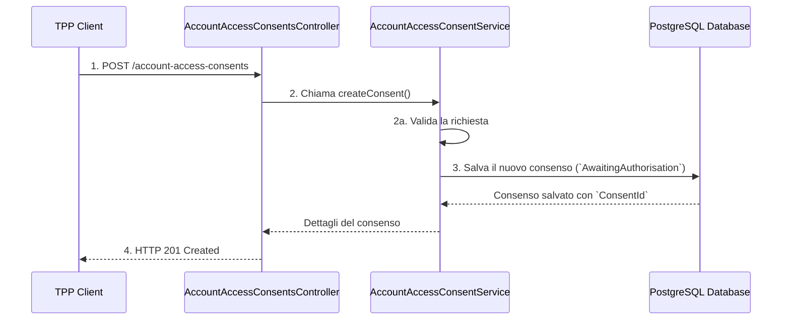

# Account Access Consents API


This is an implementation of the Open Banking UK "Account Access Consents" API. The application manages the lifecycle of consents for accessing account information, ensuring compliance with the security specifications and business logic required by the Open Banking framework.

## Technologies Used

- **Java 21**: Programming language
- **Spring Boot 3.5.3**: Framework for creating stand-alone and production-ready applications
- **Spring Data JPA**: For data persistence and database interaction
- **PostgreSQL**: Relational database for storing consents
- **Lombok**: To reduce boilerplate code (getters, setters, constructors, etc.)
- **OpenAPI 3.0.3**: For defining and generating API endpoints
- **Maven**: Project and dependency management tool

## Main Features

- **Consent Lifecycle**: The application manages the state transitions of a consent
- **Security**: Implements the security standards required by Open Banking
- **RESTful API**: Provides endpoints for creating, updating, and revoking consents
- **Database Integration**: Uses PostgreSQL for storing consent data
- **OpenAPI Documentation**: Automatically generates API documentation
## Getting Started

### Prerequisites

- Java 17 or higher
- Maven
- PostgreSQL

### Installation

1. Clone the repository:
   ```bash
   git clone <repository-url>
   ```

2. Navigate to the project directory:
   ```bash
   cd account-access-consents-api
   ```

3. Configure the database in `application.properties` or `application.yml`.

4. Build the project:
   ```bash
   mvn clean install
   ```

5. Run the application:
   ```bash
   mvn spring-boot:run
   ```
## Endpoint API

Di seguito sono elencati gli endpoint principali implementati per la gestione dei consensi.

| **Metodo** | **Endpoint** | **Descrizione** |
| `POST` | `/account-access-consents` | Crea un nuovo consenso per l'accesso agli account. |
| `GET` | `/account-access-consents/{ConsentId}` | Recupera i dettagli di un consenso specifico utilizzando il suo ID. |
| `DELETE` | `/account-access-consents/{ConsentId}` | Revoca (elimina) un consenso esistente. |

## Flusso di Lavoro del Consenso (Diagramma Semplificato)

Questo diagramma illustra il flusso di business per la creazione e la gestione di un consenso.


**Dettagli del Flusso:**

1. Il **TPP Client** invia una richiesta `POST` con un body contenente `Permissions` e `ExpirationDateTime`.
2. Il **Controller** passa la richiesta al **Service**.
3. Il **Service** esegue la validazione dei dati. Se la validazione fallisce, il Controller restituisce un errore `400 Bad Request`.
4. Se la richiesta è valida, il **Service** genera un `ConsentId` univoco e salva il nuovo consenso nel **Database** con lo stato iniziale di `AwaitingAuthorisation`.
5. Il **Controller** restituisce una risposta `201 Created` contenente i dettagli del consenso creato.


### Configuration

Ensure that the PostgreSQL database is configured correctly in the application properties file.

### Usage

- Access the API documentation at `http://localhost:8080/swagger-ui.html` after starting the application.
- Use the provided endpoints to manage consents.

## API Endpoints

- **POST /consents**: Create a new consent
- **GET /consents/{consentId}**: Retrieve a consent by ID
- **PUT /consents/{consentId}**: Update a consent
- **DELETE /consents/{consentId}**: Revoke a consent

## Contributing

Contributions are welcome! Please fork the repository and submit a pull request.

## License

This project is licensed under the MIT License.
