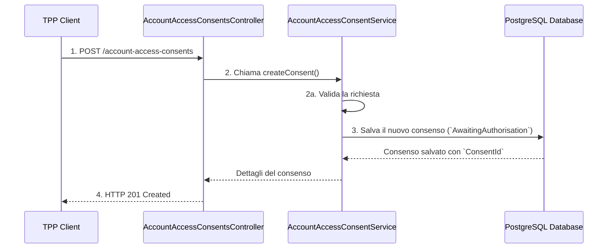

# Account Access Consents API

Questa è un'implementazione dell'API "Account Access Consents" di Open Banking UK. L'applicazione gestisce il ciclo di vita dei consensi per l'accesso alle informazioni degli account, garantendo la conformità alle specifiche di sicurezza e alle logiche di business richieste dal framework Open Banking.

## Tecnologie Utilizzate

* **Java 17+**: Linguaggio di programmazione
* **Spring Boot 3.x**: Framework per la creazione di applicazioni stand-alone e di produzione
* **Spring Data JPA**: Per la persistenza dei dati e l'interazione con il database
* **PostgreSQL**: Database relazionale per la memorizzazione dei consensi
* **Lombok**: Per ridurre il boilerplate code (getter, setter, costruttori, ecc.)
* **OpenAPI**: Per la definizione e la generazione degli endpoint API
* **Maven**: Strumento di gestione del progetto e delle dipendenze

## Funzionalità Principali

* **Ciclo di Vita del Consenso**: L'applicazione gestisce il passaggio di stato di un consenso, da `AwaitingAuthorisation` (iniziale) fino a stati successivi come `Authorised`, `Rejected`, `Revoked` o `Expired`.
* **Validazione della Richiesta**: Viene eseguita una validazione rigorosa dei dati in ingresso, inclusi:
    * La presenza obbligatoria di `ExpirationDateTime` e `Permissions`.
    * La garanzia che `ExpirationDateTime` sia una data futura.
* **Immutabilità del Consenso**: Una volta creato, un consenso non può essere modificato. Per alterare i dettagli del consenso, è necessaria la creazione di un nuovo consenso.
* **Supporto alla Revoca**: L'API consente la revoca di un consenso esistente tramite l'endpoint `DELETE`, invalidando immediatamente l'accesso ai dati.

## Endpoint API

Di seguito sono elencati gli endpoint principali implementati per la gestione dei consensi.

| **Metodo** | **Endpoint** | **Descrizione** |
| `POST` | `/account-access-consents` | Crea un nuovo consenso per l'accesso agli account. |
| `GET` | `/account-access-consents/{ConsentId}` | Recupera i dettagli di un consenso specifico utilizzando il suo ID. |
| `DELETE` | `/account-access-consents/{ConsentId}` | Revoca (elimina) un consenso esistente. |

## Flusso di Lavoro del Consenso (Diagramma Semplificato)

Questo diagramma illustra il flusso di business per la creazione e la gestione di un consenso.


**Dettagli del Flusso:**

1. Il **TPP Client** invia una richiesta `POST` con un body contenente `Permissions` e `ExpirationDateTime`.
2. Il **Controller** passa la richiesta al **Service**.
3. Il **Service** esegue la validazione dei dati. Se la validazione fallisce, il Controller restituisce un errore `400 Bad Request`.
4. Se la richiesta è valida, il **Service** genera un `ConsentId` univoco e salva il nuovo consenso nel **Database** con lo stato iniziale di `AwaitingAuthorisation`.
5. Il **Controller** restituisce una risposta `201 Created` contenente i dettagli del consenso creato.

## Setup e Avvio del Progetto

1. **Prerequisiti**: Assicurati di avere installati Java 17+, Maven e un'istanza di PostgreSQL funzionante.
2. **Configurazione del Database**:
    * Crea un database PostgreSQL con il nome `account_consents`.
    * Aggiorna il file `src/main/resources/application.properties` con le credenziali del tuo database:
      ```
      spring.datasource.url=jdbc:postgresql://localhost:5432/account_consents
      spring.datasource.username=your_username
      spring.datasource.password=your_password
      spring.jpa.hibernate.ddl-auto=update
      ```